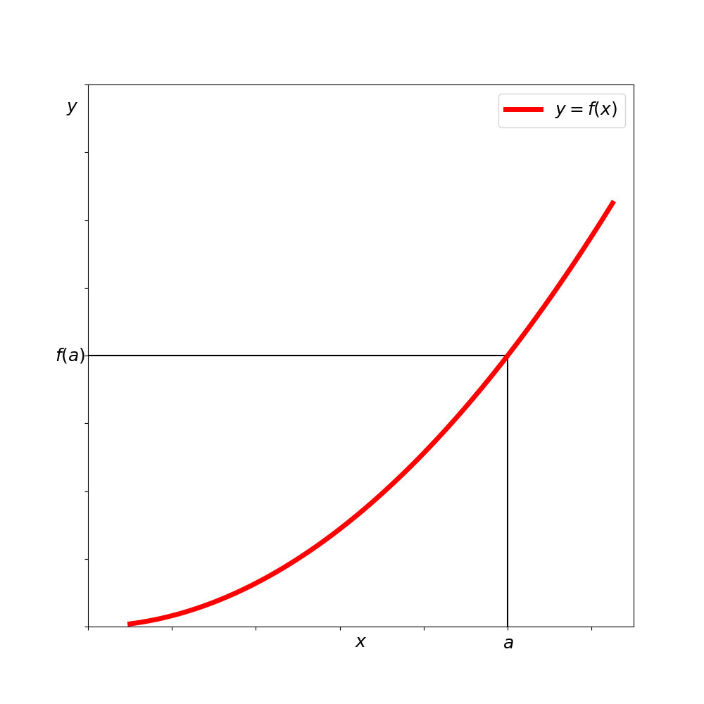
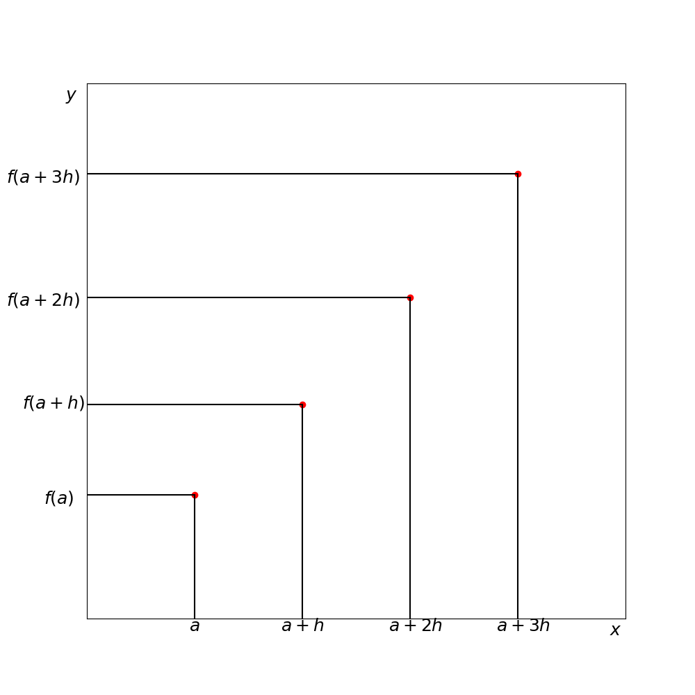
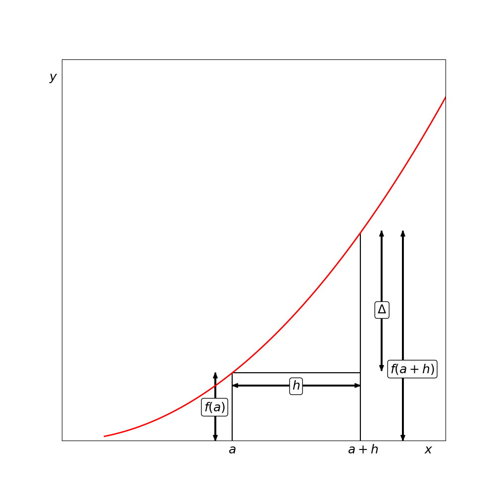

# Appendix 3: Difference Tables and Finite Difference Calculus

## Mathematical Foundations

The calculus of finite differences provides a powerful method for analyzing measured variables. Let's first explore the mathematical principles before applying them to practical measurements.

Consider a known function $y = f(x)$ as shown in Figure 1. If this function is analytic at point $x = a$, we can express it using Taylor's expansion:

$$f(x) = f(a) + (x-a)\left(\frac{df}{dx}\right)_a + \frac{(x-a)^2}{2!}\left(\frac{d^2f}{dx^2}\right)_a + \cdots$$

*Figure 1: Graph of the function y=f(x)*

This function is defined along a continuous range of x-values. To make the theory applicable to measured variables, we need to convert it to work with *discrete* values of x. Let's space these discrete values at equal intervals h, starting from x = a:

$$x = a, x = a + h, x = a + 2h, x = a + 3h, \dots$$

The corresponding y-values would be:

$$f(a), f(a+h), f(a+2h), f(a+3h), \dots$$

These discrete values can be visualized as shown in Figure 2.

*Figure 2: Values of f(x) at discrete x-values near x=a*

To develop a discrete analog of the Taylor expansion, we'll use finite differences to approximate derivatives. We define the first difference $\Delta f(a)$ as:

$$\Delta f(a) = f(a+h) - f(a)$$

Similarly:
$$\Delta f(a+h) = f(a+2h) - f(a+h)$$

These first differences relate to the first derivatives at various x-values. We can continue to define higher-order differences:

$$\Delta^2 f(a) = \Delta f(a+h) - \Delta f(a)$$

And so on for third and higher differences.

When we arrange these differences alongside the function values, we create what's called a **difference table**. Table 1 shows a difference table for the function $y = 2x + x^3$.

**Table 1: Difference Table for the function y = 2x + x³**

| x | y | Δ | Δ² | Δ³ | Δ⁴ |
|---|---|---|---|---|---|
| 1 | 3 | | | | |
| | | 9 | | | |
| 2 | 12 | | 12 | | |
| | | 21 | | 6 | |
| 3 | 33 | | 18 | | 0 |
| | | 39 | | 6 | |
| 4 | 72 | | 24 | | 0 |
| | | 63 | | 6 | |
| 5 | 135 | | 30 | | 0 |
| | | 93 | | 6 | |
| 6 | 228 | | 36 | | 0 |
| | | 129 | | 6 | |
| 7 | 357 | | 42 | | 0 |
| | | 171 | | 6 | |
| 8 | 528 | | 48 | | 0 |
| | | 219 | | 6 | |
| 9 | 747 | | 54 | | |
| | | 273 | | | |
| 10 | 1020 | | | | |

This table illustrates key properties of difference tables - in this example, note how the third differences are constant (6) and the fourth differences are zero.

## Interpolation Using Finite Differences

Now let's consider obtaining y-values at x-values that fall between our discrete measurements. Instead of calculating these directly from the function (which we may not know), we'll develop a method using the known values and their differences.

To approximate derivatives, we can use the ratio $\Delta/h$ for the first derivative at x = a, as illustrated in Figure 3.

*Figure 3: Approximation for the gradient of f(x) at x=a*

For intermediate values between x = a and x = a+h, we introduce a parameter u defined by:

$$x = a + uh$$

Where u ranges from 0 to 1. Using this parameter and the finite differences, we can rewrite Taylor's expansion as:

$$y = f(a) + u\Delta + \frac{u(u-1)}{2!}\Delta^2 + \frac{u(u-1)(u-2)}{3!}\Delta^3 + \dots$$

This formula is known as the **Gregory-Newton interpolation formula**. It allows us to calculate intermediate values using the differences in our table.

To use this formula:
1. Construct a difference table until the differences become either zero or small enough for acceptable interpolation error
2. If the value you're seeking lies between x = a and x = a+h, use the differences along the upper edge of the table
3. If the value lies between x = a+h and x = a+2h, use the differences from the next row down

## Extrapolation Using Finite Differences

Extrapolation works similarly. If we have y-values for x ranging from a to a+(n-1)h and want to calculate the value for x = a+nh, we can extend the difference table.

Starting with the column of differences that are constant (or nearly constant), we work backwards, calculating lower-order differences until we reach the required y-value. 

Table 2 demonstrates this process. Let's say we know y-values only up to x = 6, and want to predict the value at x = 7.

**Table 2: Using a Difference Table for Extrapolation**

| x | y | Δ | Δ² | Δ³ |
|---|---|---|---|---|
| 2 | 8 | | | |
| | | 19 | | |
| 3 | 27 | | 18 | |
| | | 37 | | 6 |
| 4 | 64 | | 24 | |
| | | 61 | | 6 |
| 5 | 125 | | 30 | |
| | | 91 | | |
| 6 | 216 | | | 6 |
| | | | 30+6=36 | |
| | | 91+36=127 | | |
| 7 | 216+127=343 | | | |

Through this method, we can extend the table to provide additional function values as needed.

## Practical Applications to Measured Values

For real observations (as opposed to values from known mathematical functions), difference tables won't work out as neatly as our examples. Real measurements present two challenges:

1. There's no guarantee that any simple function exists that would lead to constant differences at some level
2. Even if a simple underlying function exists, measurement uncertainty prevents perfect constancy in the difference columns

When working with real measurements, we must use our judgment in each situation. The difference table still serves two valuable purposes:

1. **Pattern recognition**: Difference tables help identify underlying patterns in measurements, revealing whether linear, quadratic, or higher-order relationships might exist
2. **Polynomial construction**: We can use the differences to construct an interpolating polynomial that approximates the relationship between variables

For measurements with significant scatter, it's important to recognize that the difference table approach assumes an underlying regular function. You should first determine if this assumption is reasonable by examining the data. If scatter dominates any underlying pattern, statistical approaches like least-squares fitting may be more appropriate.

## Constructing Polynomials from Difference Tables

The Gregory-Newton formula can be rearranged to construct a polynomial directly from the differences. If we have values f(a), Δ, Δ², Δ³, etc., we can rewrite the formula in terms of x:

$$y = f(a) + \frac{(x-a)}{h}\Delta + \frac{(x-a)(x-a-h)}{2!h^2}\Delta^2 + \frac{(x-a)(x-a-h)(x-a-2h)}{3!h^3}\Delta^3 + \dots$$

This gives us a polynomial in x that passes through our data points. For the function in Table 1, using the values from the top row (f(a)=3, a=1, h=1, Δ=9, Δ²=12, Δ³=6, Δ⁴=0), we get:

$$y = 2x + x^3$$

Which matches our original function, confirming the effectiveness of this approach.

When working with real measurements that contain random fluctuations, this method provides a systematic way to develop approximating functions that can be used for interpolation, extrapolation, and pattern identification.
