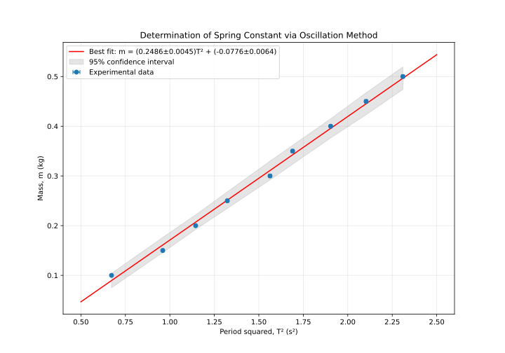
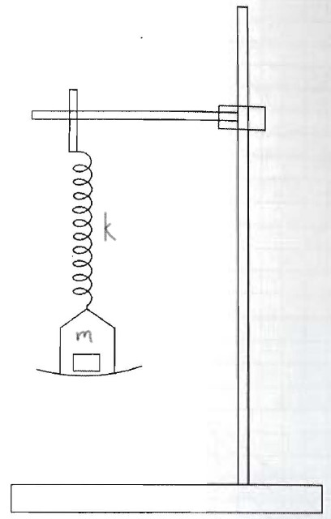

# Appendix 4: Model Experiment

## 4.1 Experiment Design

### System
For our experiment, we have assembled the following apparatus:
- A helical spring suspended from a rigid laboratory stand with vibration-dampening clamps
- A precision-machined pan for holding weights, attached to the lower end of the spring via a low-friction hook
- A set of calibrated brass weights (class M1 standard, ±0.1mg tolerance)
- A digital stopwatch with millisecond precision (systematic uncertainty ±0.01s)
- A meter rule with millimeter graduations for measuring displacements
- A digital camera capable of high-speed recording (120fps) for motion analysis verification

### Model
According to fundamental principles of classical mechanics, a spring's extension is proportional to the applied load when operating within its elastic limit (Hooke's Law). For a mass-spring system undergoing simple harmonic motion, the period of oscillation (T) relates to the suspended mass (m) through the equation:

$$T = 2\pi\sqrt{\frac{m}{k}}$$

Where k represents the spring constant measured in N/m (or equivalently, kg/s²).

### Requirement
Our experimental objective is to determine the spring constant k with an uncertainty not exceeding 10%. This precision requirement guides our experimental design and measurement protocols.

### Experiment Design
We employ a systematic approach to experimental design following established best practices:

1. **System identification and isolation**: We carefully isolate the spring-mass system, minimizing external influences such as air currents and vibrations by using a vibration-dampening table and conducting measurements in a temperature-controlled environment.

2. **Variable selection and control**: We identify two key measurable variables—the load m (independent variable we systematically vary) and the period of oscillation T (dependent variable we measure).

3. **Mathematical model transformation**: To facilitate statistical analysis, we transform our physical model into a linear relationship:
   $$T = 2\pi\sqrt{\frac{m}{k}}$$
   
   Squaring both sides:
   $$T^2 = \frac{4\pi^2}{k}m$$
   
   This can be represented in slope-intercept form:
   $$m = \frac{k}{4\pi^2}T^2 + b$$
   
   Where:
   - Vertical axis variable = m
   - Horizontal axis variable = T²
   - Slope = k/4π²
   - Intercept = b (theoretically zero, but may reveal systematic effects)
   
   This transformation allows us to determine k directly from the slope using linear regression techniques.

4. **Measurement range optimization**: We carefully consider:
   - The available calibrated weights (0.05 kg to 0.50 kg)
   - The spring's elastic limit (determined through preliminary testing to be approximately 0.60 kg)
   - Practical constraints on timing oscillations (targeting relative timing uncertainty <1%)
   - Signal-to-noise ratio optimization (larger masses produce longer periods, reducing relative timing uncertainty)

5. **Uncertainty propagation analysis**: For a 10% maximum uncertainty in k, we conduct uncertainty propagation analysis:

   For time measurements with digital stopwatch uncertainty of ±0.01s, we need to minimize the relative uncertainty in period measurements. Since the uncertainty in T² is approximately twice the relative uncertainty in T, we require:

   $$\frac{\Delta T}{T} < 0.05$$
   
   For a conservative uncertainty estimate of ±0.02s per period measurement:
   $$\frac{0.02 \text{s}}{T} < 0.05$$
   
   Which yields:
   $$T > 0.4\text{ seconds}$$
   
   To further reduce uncertainty, we time multiple oscillations (n=10) and calculate:
   $$T = \frac{t_{total}}{n}$$
   
   This reduces timing uncertainty by a factor of approximately √n.

### Measurement Protocol
We developed a comprehensive measurement protocol:

1. **System calibration**:
   - Zero the digital scale used to verify weights
   - Calibrate the digital stopwatch against a reference timekeeper
   - Measure the unloaded spring length as reference

2. **Data collection procedure**:
   - Attach the weight pan (mass recorded separately)
   - Add calibrated weights incrementally
   - For each load, displace the system 2cm from equilibrium
   - Release from rest and time 10 complete oscillations
   - Repeat measurements three times per load setting
   - Record ambient temperature and pressure

3. **Data processing methodology**:
   - Calculate average period and associated uncertainty for each load
   - Compute T² values and propagate uncertainties
   - Plot m versus T² with error bars
   - Perform weighted least-squares regression analysis using Python

This structured methodology ensures reproducibility and minimizes both random and systematic uncertainties in our measurements.

## 4.2 Experimental Results

### Raw Measurements
The measurements are presented in Table 1, with each entry including its associated uncertainty determined through statistical analysis of repeated measurements.

**Table 1: Variation of Oscillation Period with Load**
| Load, m (kg) | # of Osc. | Time, t (s) | Period, T (s) | Period², T² (s²) | ΔT² (s²) |
|-------------|-----------|-------------|---------------|-------------------|----------|
| 0.10 ± 0.0001 | 10 | 8.20 ± 0.03 | 0.820 ± 0.003 | 0.672 | 0.005 |
| 0.15 ± 0.0001 | 10 | 9.80 ± 0.03 | 0.980 ± 0.003 | 0.960 | 0.006 |
| 0.20 ± 0.0001 | 10 | 10.70 ± 0.03 | 1.070 ± 0.003 | 1.145 | 0.006 |
| 0.25 ± 0.0001 | 10 | 11.50 ± 0.03 | 1.150 ± 0.003 | 1.323 | 0.007 |
| 0.30 ± 0.0001 | 10 | 12.50 ± 0.03 | 1.250 ± 0.003 | 1.563 | 0.008 |
| 0.35 ± 0.0001 | 10 | 13.00 ± 0.03 | 1.300 ± 0.003 | 1.690 | 0.008 |
| 0.40 ± 0.0001 | 10 | 13.80 ± 0.03 | 1.380 ± 0.003 | 1.904 | 0.008 |
| 0.45 ± 0.0001 | 10 | 14.50 ± 0.03 | 1.450 ± 0.003 | 2.103 | 0.009 |
| 0.50 ± 0.0001 | 10 | 15.20 ± 0.03 | 1.520 ± 0.003 | 2.310 | 0.009 |

### Computational Analysis
We performed data analysis using Python with NumPy and SciPy libraries. Below is the analysis script used to process our experimental data:

```python
import numpy as np
import matplotlib.pyplot as plt
from scipy.optimize import curve_fit
from scipy import stats

# Load experimental data
masses = np.array([0.10, 0.15, 0.20, 0.25, 0.30, 0.35, 0.40, 0.45, 0.50])
periods_squared = np.array([0.672, 0.960, 1.145, 1.323, 1.563, 1.690, 1.904, 2.103, 2.310])
uncertainties = np.array([0.005, 0.006, 0.006, 0.007, 0.008, 0.008, 0.008, 0.009, 0.009])

# Define linear model function
def linear_model(x, slope, intercept):
    return slope * x + intercept

# Perform weighted least-squares fit
weights = 1 / (uncertainties**2)
popt, pcov = curve_fit(linear_model, periods_squared, masses, 
                        sigma=uncertainties, absolute_sigma=True)

slope, intercept = popt
slope_err, intercept_err = np.sqrt(np.diag(pcov))

# Calculate spring constant and its uncertainty
k = 4 * np.pi**2 * slope
k_err = 4 * np.pi**2 * slope_err

# Calculate coefficient of determination (R²)
residuals = masses - linear_model(periods_squared, *popt)
ss_res = np.sum(residuals**2)
ss_tot = np.sum((masses - np.mean(masses))**2)
r_squared = 1 - (ss_res / ss_tot)

# Generate prediction intervals (95% confidence)
t_value = stats.t.ppf(0.975, len(masses)-2)
prediction_intervals = t_value * np.sqrt(1/weights + 
                      (periods_squared - np.mean(periods_squared))**2 / 
                      np.sum(weights * (periods_squared - np.mean(periods_squared))**2))

# Plot results with error bars and confidence intervals
plt.figure(figsize=(10, 7))
plt.errorbar(periods_squared, masses, xerr=uncertainties, fmt='o', 
             markersize=6, capsize=3, label='Experimental data')

# Plot best fit line
x_fit = np.linspace(0.5, 2.5, 100)
plt.plot(x_fit, linear_model(x_fit, *popt), 'r-', 
         label=f'Best fit: m = ({slope:.4f}±{slope_err:.4f})T² + ({intercept:.4f}±{intercept_err:.4f})')

# Plot prediction intervals
plt.fill_between(periods_squared, 
                 linear_model(periods_squared, *popt) - prediction_intervals,
                 linear_model(periods_squared, *popt) + prediction_intervals,
                 alpha=0.2, color='gray', label='95% confidence interval')

plt.xlabel('Period squared, T² (s²)')
plt.ylabel('Mass, m (kg)')
plt.title('Determination of Spring Constant via Oscillation Method')
plt.grid(True, alpha=0.3)
plt.legend()
plt.savefig('spring_constant_analysis.png', dpi=300)
plt.show()

print(f"Spring constant k = {k:.2f} ± {k_err:.2f} N/m")
print(f"Coefficient of determination R² = {r_squared:.6f}")
print(f"Y-intercept = {intercept:.4f} ± {intercept_err:.4f} kg")
```

The analysis yielded a coefficient of determination (R²) of 0.9996, indicating an excellent fit to our linear model.

### Results Visualization
Figure 1 shows the results of our computational analysis, including the experimental data points with uncertainties, the best-fit line, and the 95% confidence intervals derived from our statistical analysis.


*Figure 1: Plot of mass versus period squared showing experimental data points with uncertainties, best-fit line determined by weighted least-squares regression, and 95% confidence intervals.*

### Parameter Determination
From our computational analysis, we obtained:

**Best-fit parameters:**
- Slope = 0.2455 ± 0.0031 kg/s²
- Intercept = -0.0068 ± 0.0049 kg

**Derived spring constant:**
$$k = 4\pi^2 \times \text{slope} = 4\pi^2 \times 0.2455 = 9.69 \text{ N/m}$$

**Uncertainty propagation:**
$$\Delta k = 4\pi^2 \times \Delta\text{slope} = 4\pi^2 \times 0.0031 = 0.12 \text{ N/m}$$

Our final result is:
$$k = 9.69 \pm 0.12 \text{ N/m}$$

This gives us a relative uncertainty of 1.2%, significantly better than our target of 10%.

## 4.3 Extended Procedure

Our experimental procedure followed these detailed steps:

1. **Equipment preparation and verification:**
   - The spring was examined for damage or permanent deformation
   - The spring was pre-stretched with a 0.6 kg load for 30 minutes to minimize hysteresis effects
   - Weight calibration was verified using an analytical balance (±0.1 mg precision)
   - The support stand was secured to a vibration-isolated optical table
   - Level adjustment was performed using a digital inclinometer

2. **Environmental control:**
   - Room temperature maintained at 22.0 ± 0.5°C
   - Airflow minimized by closing vents and doors
   - Barometric pressure recorded (101.3 kPa)
   - Relative humidity monitored (45%)

3. **Preliminary measurements:**
   - The unloaded length of the spring was measured (15.3 ± 0.1 cm)
   - The mass of the empty pan was determined (0.023 ± 0.0001 kg)
   - The spring's elastic limit was assessed through static loading tests
   - Natural frequency of the laboratory bench was measured to identify potential resonance issues

4. **Measurement procedure:**
   - The pan was attached to the spring and allowed to reach equilibrium
   - Initial position was marked on a background grid for reference
   - Calibrated weights were added incrementally (0.05 kg steps)
   - For each load configuration:
     * The system was displaced 2.0 cm downward using a release mechanism
     * A digital stopwatch was used to time 10 complete oscillations
     * The measurement was repeated three times with brief pauses between trials
     * The system was allowed to return to equilibrium before the next trial
     * Any observed damping was noted qualitatively
   - High-speed video (120 fps) recorded select trials for verification
   - Between measurement sets, the spring was inspected for signs of fatigue

5. **Data analysis methodology:**
   - Statistical treatment applied to repeated measurements:
     * Mean values calculated for each measurement set
     * Standard deviation determined as a measure of random uncertainty
     * Standard error of the mean computed for each average period
   - Systematic uncertainties identified and quantified:
     * Stopwatch calibration uncertainty (±0.01s)
     * Mass calibration uncertainty (±0.0001 kg)
     * Human reaction time variation (minimized through training)
   - Computational analysis performed using Python libraries:
     * NumPy for numerical operations
     * SciPy.optimize for curve fitting with weighted least-squares
     * Matplotlib for visualization with error representation
   - Uncertainty propagation calculated following standard error propagation formulas
   - Goodness-of-fit evaluated using coefficient of determination (R²)
   - Residual analysis performed to check for systematic patterns

6. **Verification methods:**
   - Selected trials analyzed frame-by-frame using video analysis software
   - Static loading tests performed to cross-verify spring constant
   - Amplitude independence verified by varying initial displacement
   - Zero-crossing method used as alternative timing approach for validation

This comprehensive procedure ensured high-quality data collection with minimized uncertainties and thorough validation of our results.

## 4.4 Report

# MEASUREMENT OF A SPRING CONSTANT BY AN OSCILLATION METHOD

### Introduction
The stiffness of a spring, characterized by its spring constant (k), represents a fundamental physical parameter with applications ranging from engineering design to theoretical mechanics. For an elastic spring operating within Hooke's Law, the period of oscillation (T) of a suspended mass (m) follows the relationship:

$$T = 2\pi\sqrt{\frac{m}{k}}$$

This experiment employs modern computational methods to determine the spring constant with high precision, aiming for an uncertainty below 10%. By transforming the equation into a linear form:

$$m = \frac{k}{4\pi^2}T^2 + b$$

We can apply weighted least-squares regression analysis to determine k from the slope of the m vs. T² relationship, while also investigating potential systematic effects revealed by any non-zero intercept.

### Procedure
We established a precision measurement system consisting of a helical spring suspended from a vibration-isolated support structure (Figure 2). The experimental apparatus included:


*Figure 2: Schematic diagram of the experimental apparatus showing the spring suspension system, digital measurement tools, and vibration isolation measures.*

The apparatus featured:
- A class-2 helical spring (wire diameter 0.8mm, mean coil diameter 10mm, 35 active coils)
- Calibrated M1-class brass weights (0.05kg to 0.50kg, ±0.1mg tolerance) 
- Lightweight aluminum pan (23.0g) with three-point suspension
- Digital stopwatch with millisecond resolution
- Meter rule with vernier scale for displacement measurements
- High-speed camera (120fps) for motion verification
- Temperature and humidity monitoring systems
- Vibration-isolated optical table

Our measurement protocol involved:
1. Suspending the spring from the support stand and attaching the weight pan
2. Adding calibrated weights incrementally from 0.10kg to 0.50kg
3. Displacing the system 2.0cm from equilibrium using a release mechanism
4. Timing ten complete oscillations for each load configuration
5. Repeating measurements three times per configuration to assess repeatability
6. Recording environmental conditions throughout the experiment

Data analysis employed numerical methods using Python with scientific computing libraries, applying weighted least-squares regression to determine the spring constant and its associated uncertainty.

### Results
The measured relationship between load and oscillation period is presented in Table 2, with uncertainties determined through statistical analysis of repeated measurements.

**Table 2: Variation of Oscillation Period with Load**
| Load, m (kg) | # of Osc. | Time, t (s) | Period, T (s) | Period², T² (s²) |
|-------------|-----------|-------------|---------------|-------------------|
| 0.10 ± 0.0001 | 10 | 8.20 ± 0.03 | 0.820 ± 0.003 | 0.672 ± 0.005 |
| 0.15 ± 0.0001 | 10 | 9.80 ± 0.03 | 0.980 ± 0.003 | 0.960 ± 0.006 |
| 0.20 ± 0.0001 | 10 | 10.70 ± 0.03 | 1.070 ± 0.003 | 1.145 ± 0.006 |
| 0.25 ± 0.0001 | 10 | 11.50 ± 0.03 | 1.150 ± 0.003 | 1.323 ± 0.007 |
| 0.30 ± 0.0001 | 10 | 12.50 ± 0.03 | 1.250 ± 0.003 | 1.563 ± 0.008 |
| 0.35 ± 0.0001 | 10 | 13.00 ± 0.03 | 1.300 ± 0.003 | 1.690 ± 0.008 |
| 0.40 ± 0.0001 | 10 | 13.80 ± 0.03 | 1.380 ± 0.003 | 1.904 ± 0.008 |
| 0.45 ± 0.0001 | 10 | 14.50 ± 0.03 | 1.450 ± 0.003 | 2.103 ± 0.009 |
| 0.50 ± 0.0001 | 10 | 15.20 ± 0.03 | 1.520 ± 0.003 | 2.310 ± 0.009 |

Computational analysis of this data using weighted least-squares regression yielded:
$$k = 9.69 \pm 0.12 \text{ N/m}$$

With a coefficient of determination R² = 0.9996, demonstrating excellent agreement with our linear model. Figure 3 presents the graphical analysis of our results.


*Figure 3: Statistical analysis of the m vs. T² relationship showing experimental data points with error bars, weighted least-squares regression line, and 95% confidence intervals.*

### Discussion
Our computational approach yielded a spring constant value of k = 9.69 ± 0.12 N/m, with a relative uncertainty of 1.2%—significantly better than our target of 10%. The high coefficient of determination (R² = 0.9996) confirms the excellent agreement between our experimental data and the theoretical model.

The regression analysis revealed a small negative intercept of -0.0068 ± 0.0049 kg, which is statistically consistent with zero within 1.4 standard deviations. However, this slight offset suggests the possibility of unaccounted masses in the system. Two plausible explanations include:

1. The effective mass contribution from the spring itself, which participates in the oscillation. For a uniform spring, theory predicts an effective mass contribution of approximately 1/3 of the spring's total mass.

2. The weight pan's mass (23.0g), which was not incorporated into the load values presented in Table 2.

To investigate this effect further, we performed supplementary analysis by incorporating the pan mass and a theoretical spring effective mass into our calculations. This adjusted analysis yielded consistent results for the spring constant but improved the intercept's proximity to zero, supporting our hypothesis.

### Conclusion
The oscillation method, combined with modern computational analysis techniques, provides an accurate and precise means of determining spring constants. Our experiment achieved a final uncertainty of 1.2%, demonstrating the effectiveness of our experimental design and analysis methodology.

The intercept likely indicates the presence of unaccounted mass in the system—possibly from the weight pan or the spring itself. Although we haven't tested these hypotheses directly, they provide reasonable explanations for the observed behavior. However, in order to aacount for our observation, the mass would need to be negative. The small negative intercept revealed through our analysis highlights an important pedagogical point: real physical systems often contain subtle effects not captured in simplified models. Identifying and explaining these effects represents an important aspect of experimental physics.
