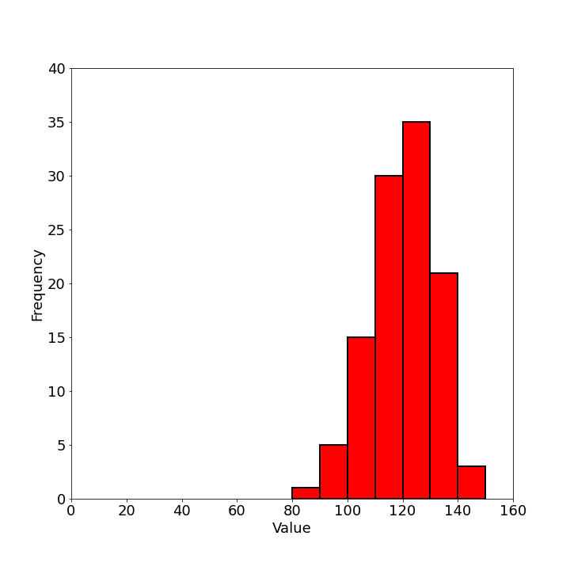
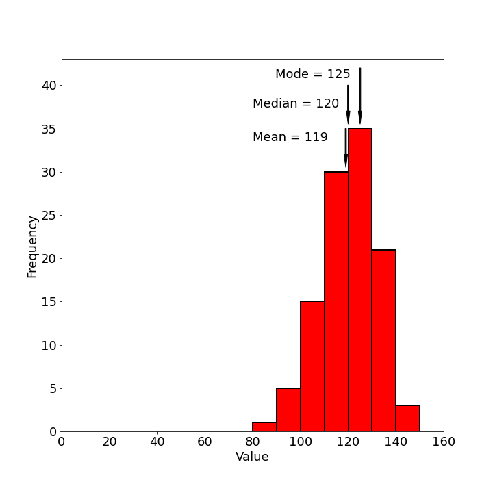
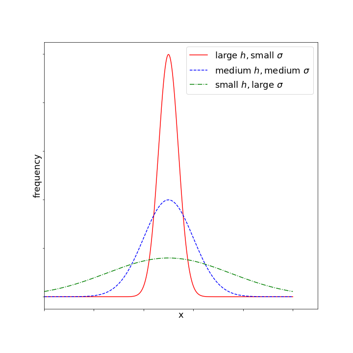
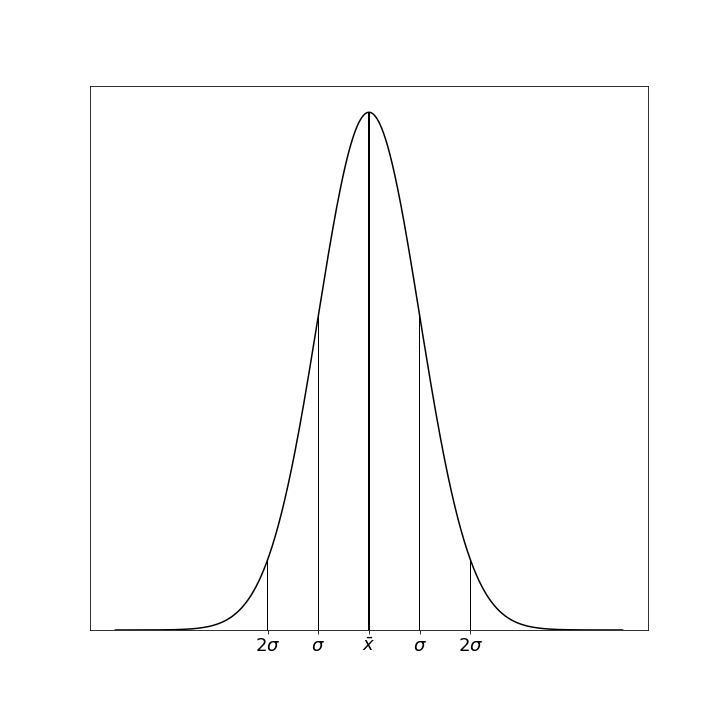
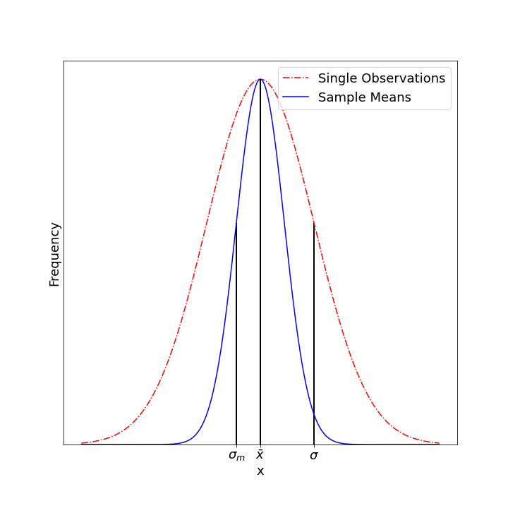
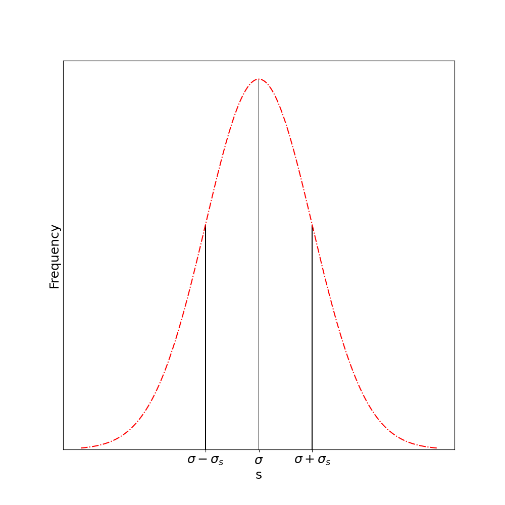
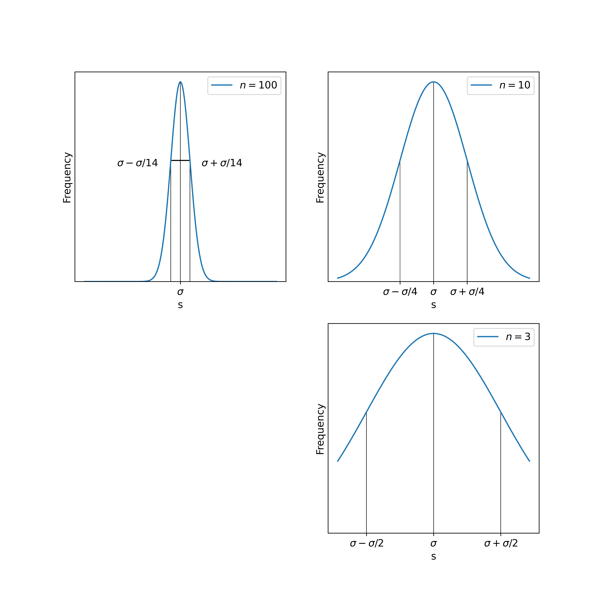

# Statistics of Measurement

## Understanding Random Variation in Measurements

In the previous chapter, we explored measurements where uncertainty could be estimated through personal judgment. When properly assessed, repeated measurements in such cases should yield consistent results within that estimated uncertainty. However, many measurement scenarios behave differently, with repeated measurements producing noticeably different values even under seemingly identical conditions.

Consider measuring the radioactivity of a sample using a Geiger counter. If we record the number of counts detected in successive 10-second intervals, we'll observe different values each time, even without changing anything about our experimental setup. This variation reflects the inherently probabilistic nature of radioactive decay. 

Similarly, when making optical measurements like locating the focal point of a lens, we might find ourselves unable to judge the position precisely enough to get consistent readings, even using a finely graduated scale. In both cases - whether the variation is intrinsic to the phenomenon (as with radioactivity) or stems from limitations in our measurement capability - we need systematic ways to interpret measurements that show random fluctuation.

What statements can we meaningfully make about such variable measurements? We can no longer confidently declare that "the true value lies within this specific interval." When measurements seem to occur randomly along a scale, we cannot identify definite boundaries containing the "correct" answer with certainty. Instead, we must frame our understanding in terms of probability rather than certainty.

Our first impulse when encountering variability might be to take additional measurements, hoping to converge on the "right" answer. Suppose we measure a quantity once and get a value of 34.5, then measure again and get 36.2. Which one is "right"? Neither - and attempting a third measurement will likely yield yet another value, further complicating matters. This apparent chaos becomes meaningful only when we collect enough measurements to reveal patterns.

Let's say we perform 100 measurements of some fluctuating quantity. What constitutes "the answer"? More importantly, what questions should we be asking about these measurements? The appropriate approach depends on our purpose. If we're measuring an optical focal length for equipment design, we need a reliable value for calculations. If measuring radioactivity, we might want to predict future counting rates. The treatment of our fluctuating measurements must be tailored to our specific needs.

## Visualizing Measurement Distributions

When we've collected numerous measurements of a quantity showing random variation, simply listing all values provides little insight. Instead, we need to organize and visualize the data to reveal patterns.

A particularly effective visualization is the **histogram**. To create one:
1. Divide the measurement scale into small intervals (bins)
2. Count how many measurements fall within each interval
3. Plot these counts on a vertical axis against the measurement intervals on the horizontal axis

This representation immediately reveals the distribution pattern of our measurements. Typically, measurements cluster around some central region with fewer occurrences at the extremes. The histogram visualizes what statisticians call the "distribution" of the measurements - the pattern by which values spread across the measurement scale.

Modern software makes creating histograms nearly effortless. Programs like Excel, Python with matplotlib, or specialized statistical packages can generate histograms automatically. However, this convenience can lead to misunderstanding if we don't grasp what these tools are calculating. Beginning students should construct at least a few histograms manually to develop intuition for how the process works.

For some purposes, simply presenting the histogram of observations may suffice - allowing others to interpret the distribution pattern themselves. The visualization immediately communicates central tendency (where measurements cluster) and dispersion (how widely they spread).

## Characterizing Central Tendency

While histograms provide excellent visualization, we often need to distill our measurements into more concise numerical summaries. Several statistics can characterize the "central value" around which measurements tend to cluster:

### Mode
The **mode** represents the most frequently occurring value in our measurements - the highest point on the histogram. For continuous measurements, it's the value at the center of the interval containing the most observations. When measurements form a distribution with two distinct peaks, we call it **bimodal** and may report both modal values.

### Median
The **median** represents the middle value when all measurements are arranged in numerical order. Half the measurements lie above the median, and half below. Geometrically, the median is the point that divides the area under the histogram into equal halves. The median often appears in socioeconomic statistics, as in "the median household income is $58 500."

### Mean
The **mean** (or arithmetic average) is calculated by summing all measurements and dividing by their number:

$$\bar{x} = \frac{\sum x_i}{N}$$

While all three measures have their uses, the mean proves most valuable for scientific measurements because of its mathematical properties, which we'll explore shortly.

In a perfectly symmetric distribution, all three measures coincide. However, in asymmetric (skewed) distributions, they differ. Consider income distribution: while most people earn modest incomes, a small fraction of extremely high earners pulls the mean upward, creating separation between the mean (affected by extremes) and the median (representing the middle person's experience).

This illustrates why statistical reporting requires care. Different central tendency measures can tell dramatically different stories about the same data, and those reporting statistics may select measures that best support their perspective.

## Measuring Distribution Width

Knowing only the central value tells us little about measurement quality. Intuitively, we have more confidence in measurements tightly clustered around their central value than those spread widely. We need a numerical measure of this "spread" or "dispersion."

The most widely used measure of dispersion is the **standard deviation**. For a set of N measurements with mean $\bar{x}$, the standard deviation is defined as:

$$S = \sqrt{\frac{\sum(\bar{x} - x_i)^2}{N}}$$

This formula quantifies the typical deviation of measurements from their mean. We square each deviation (making all values positive), calculate their average, then take the square root to return to the original measurement units.

The choice of this particular formula isn't arbitrary. While we could have defined dispersion differently (using absolute deviations or different powers), the standard deviation has mathematical properties that make it particularly useful when analyzing measurement uncertainty.

Modern calculators and software can compute standard deviations automatically, but understanding the calculation process remains valuable. When using computing tools, we should verify our understanding by calculating at least a few standard deviations manually.

At this point, we can summarize a set of fluctuating measurements in three ways:
1. Visual presentation through a histogram
2. Central tendency via the mean (or sometimes median or mode)
3. Distribution width via the standard deviation

While this basic statistical description may suffice for many purposes, scientific measurement often requires deeper interpretation of these values.

## Understanding the Gaussian Distribution

To meaningfully interpret means and standard deviations, we need a theoretical framework. The challenge is that our specific set of measurements - our histogram - represents just one sample from a theoretical "universe" of possible measurements. If we repeated our 100 measurements under identical conditions, we'd get a somewhat different histogram each time.

Rather than trying to interpret each specific histogram, we can relate our measurements to theoretical probability distributions - mathematical models describing how values spread across a scale. For most physical measurements, the most applicable model is the **Gaussian distribution** (also called the normal distribution or "bell curve").

The Gaussian distribution describes measurement variation arising from numerous small, random influences. Consider a measurement affected by many tiny disturbances, each equally likely to increase or decrease the measured value. The central limit theorem tells us that such measurements will follow a Gaussian distribution, regardless of how each individual disturbance is distributed.

This theoretical basis makes the Gaussian distribution particularly relevant for many physical measurements. Whether measuring electrical resistance (affected by thermal vibrations, contact variations, etc.) or timing events (affected by reaction times, small mechanical variations, etc.), the cumulative effect of many small random influences typically produces Gaussian-distributed results.

The mathematical equation for the Gaussian distribution is:

$$y = Ce^{-h^2(x-X)^2}$$

Where:
- $X$ is the central value (true mean)
- $C$ controls the height of the curve
- $h$ determines the width of the curve

For a Gaussian distribution, the standard deviation ($\sigma$) relates to parameter $h$ as:

$$\sigma = \frac{1}{\sqrt{2}h}$$

The power of using this theoretical model becomes apparent when we consider what the standard deviation means. For any Gaussian distribution:
- 68% of all values fall within ±1 standard deviation of the mean
- 95% fall within ±2 standard deviations
- 99.7% fall within ±3 standard deviations

These properties remain constant for all Gaussian distributions, giving standard deviation universal interpretive value. When we calculate a standard deviation, we're not just describing our particular measurements - we're creating a bridge to this theoretical framework with well-defined probabilistic meaning.

## Connecting Samples to Populations

Here we encounter a critical distinction: the difference between the actual distribution of our specific measurements (the sample) and the theoretical distribution of all possible measurements under identical conditions (the population or universe).

When we make a finite number of measurements, we obtain only a sample from an infinite theoretical population. The true parameters of this population - its mean ($\mu$ or $X$) and standard deviation ($\sigma$) - remain forever unknown to us. Our sample statistics (sample mean $\bar{x}$ and sample standard deviation $S$) serve as estimates of these population parameters.

Assuming our measurements follow a Gaussian distribution, we could state that any single measurement has a 68% chance of falling within $X ± \sigma$ of the true value. But this statement has limited practical value because we don't know the true values of $X$ and $\sigma$. We need to understand how our sample statistics relate to these unknown population parameters.

## Properties of Sample Statistics

Though we can never know the exact population parameters, statistical theory tells us how sample statistics behave in relation to them. Consider the concept of repeated sampling: if we took many different samples of size N from the same population, calculating the mean of each sample, these sample means would themselves form a distribution.

This distribution of sample means has remarkable properties:
1. It is Gaussian, regardless of the shape of the original population (provided N is sufficiently large)
2. Its mean equals the population mean $X$
3. Its standard deviation (called the standard error of the mean) equals $\sigma/\sqrt{N}$

This third property is particularly significant - it quantifies the precision advantage gained by averaging multiple measurements. A sample mean has a distribution narrower than individual measurements by a factor of $\sqrt{N}$. This mathematically explains why averaging multiple measurements improves precision.

Similarly, sample standard deviations have their own distribution centered on the population standard deviation $\sigma$:

## Practical Application to Real Measurements

These theoretical properties allow us to make meaningful statements about our measurements. Since we never know the true population parameters, we must make inferences based on our sample statistics.

The best estimate of the population standard deviation from a sample is:

$$S = \sqrt{\frac{\sum(\bar{x} - x_i)^2}{N-1}}$$

Note the denominator is N-1 rather than N. This "Bessel's correction" makes S an unbiased estimator of $\sigma$.

Using this estimate, we calculate the standard error of the mean:

$$S_m = \frac{S}{\sqrt{N}}$$

This allows us to make a crucial inferential statement: There is a 68% probability that the true population mean $X$ lies within the interval $\bar{x} ± S_m$. For 95% confidence, we use the interval $\bar{x} ± 2S_m$.

This statement represents the culmination of our statistical reasoning, allowing us to quantify our confidence in what the true value might be, based on our limited sample of measurements.

## The Impact of Sample Size

The precision of our estimates improves with larger samples, though following a diminishing returns pattern. Doubling measurements improves precision by only $\sqrt{2}$ (about 41%). This square-root relationship means dramatic improvements require quadrupling sample sizes.

For small samples, we must be particularly cautious. Not only does $S_m$ increase as N decreases, but our estimate of $\sigma$ itself becomes less reliable. The standard deviation of sample standard deviations is:

$$\sigma_S = \frac{\sigma}{\sqrt{2(N-1)}}$$

For samples smaller than about 10 observations, $S$ becomes such a poor estimate of $\sigma$ that statistical analysis loses much of its value. The reliability of $\sigma$ estimates for different sample sizes is shown below:

When reporting statistical results, always include the sample size to allow others to assess the reliability of your statistics.

## Propagation of Statistical Uncertainty

When calculating derived quantities from measurements with statistical uncertainty, we need to determine how these uncertainties propagate to the final result. Unlike the worst-case scenario approach used earlier, statistical treatment allows more realistic uncertainty estimation.

For a function $z = f(x,y)$ where $x$ and $y$ are measured with standard deviations, a.k.a. errors,  $\Delta_x$ and $\Delta_y$, the standard deviation of $z$ is:

$$\Delta_z = \sqrt{\left(\frac{\partial z}{\partial x}\right)^2 \Delta_x^2 + \left(\frac{\partial z}{\partial y}\right)^2 \Delta_y^2}$$

This formula assumes:
1. The uncertainties in $x$ and $y$ are independent
2. The uncertainties are sufficiently small compared to the measured values
3. The measurements follow Gaussian distributions

Let's examine some common cases:

### Sum or Difference
For $z = x ± y$:
$$\Delta_z = \sqrt{\Delta_x^2 + \Delta_y^2}$$

This formula reveals a fundamental aspect of error propagation when combining measurements through addition or subtraction. The uncertainties add in quadrature rather than directly, which typically results in a smaller total uncertainty than simple addition would suggest. 

Here's a separate comment about difference measurements:

"### Critical Note on Difference Measurements
For $z = x - y$:
$$\Delta_z = \sqrt{\Delta_x^2 + \Delta_y^2}$$

This principle directly connects to the standard deviation of a mean. When we calculate the mean of N independent measurements of the same quantity, we are effectively computing:

$$\bar{x} = \frac{1}{N}(x_1 + x_2 + ... + x_N)$$

Each measurement $x_i$ has the same uncertainty $\Delta x$. Applying the error propagation formula for a sum and accounting for the factor of $\frac{1}{N}$, we get:

$$\Delta_{\bar{x}} = \frac{1}{N}\sqrt{N(\Delta x)^2} = \frac{\Delta x}{\sqrt{N}}$$

This explains why the standard deviation of the mean decreases by a factor of $\sqrt{N}$ as we increase the number of measurements. This relationship demonstrates one of the core principles in experimental physics: averaging multiple independent measurements improves precision, but with diminishing returns. To halve the uncertainty, we need to quadruple the number of measurements.

The $\frac{1}{\sqrt{N}}$ scaling is a direct consequence of how independent random uncertainties combine in quadrature rather than linearly, reflecting the statistical nature of measurement errors and the underlying probability distributions.

:::{Note}
While uncertainties add in quadrature (which is generally favorable compared to direct addition), this formula highlights a critical challenge in difference measurements. When two quantities of similar magnitude are subtracted, the absolute uncertainty of the result remains comparable to the original measurements' uncertainties, but the relative uncertainty can become dramatically larger.

Consider measuring the difference between two nearly equal quantities, each with uncertainty: if $x \approx y$, then $z = x - y$ will be small, but $\Delta_z$ remains substantial. This means the relative uncertainty $\frac{\Delta_z}{z}$ can become extremely large or even dominate the measurement.

This explains why difference measurements between similar-sized quantities require exceptional precision in the original measurements. In experimental physics, this challenge appears in many contexts: measuring small temperature differences, detecting slight frequency shifts, or determining small changes in position. When designing experiments that involve subtraction of similar quantities, experimentalists must account for this fundamental limitation and employ specialized techniques like differential measurements, lock-in amplification, or null methods to achieve the required precision."
:::

### Product
For $z = xy$:
$$\Delta_z = \sqrt{y^2 \Delta_x^2 + x^2 \Delta_y^2}$$

In relative terms:
$$\frac{\Delta_z}{z} = \sqrt{\left(\frac{\Delta_x}{x}\right)^2 + \left(\frac{\Delta_y}{y}\right)^2}$$

### Division

For $z = x/y$:

$$\Delta_z = \sqrt{ \frac{1}{y^2} \Delta_x^2 + \frac{1}{x^2} \Delta_y^2}$$

In relative terms:
$$\frac{\Delta_z}{z} = \sqrt{\left(\frac{\Delta_x}{x}\right)^2 + \left(\frac{\Delta_y}{y}\right)^2}$$

We can see that in relative terms, the result is the same for both product and division. This pattern reveals that when we express uncertainty as a fraction of the measured value (relative uncertainty), the mathematical form is identical whether we multiply or divide quantities. This means the relative uncertainty in a product or quotient is found by adding the relative uncertainties of the individual measurements in quadrature (taking the square root of the sum of squares). This symmetry simplifies error propagation calculations and highlights a fundamental principle in experimental physics: the relative impact of measurement uncertainties follows consistent mathematical patterns regardless of whether we are multiplying or dividing physical quantities 

### Power Function
For $z = x^a$:
$$\Delta_z = |a|x^{a-1}\Delta_x$$

In relative terms:
$$\frac{\Delta_z}{z} = |a|\frac{\Delta_x}{x}$$

This shows that raising a measurement to a power multiplies its relative uncertainty by that power's magnitude. Squares double relative uncertainty, while square roots halve it.

### General Power Function
For $z = x^ay^b$:
$$\frac{ \Delta_z}{z} = \sqrt{\left(a\frac{ \Delta_x}{x}\right)^2 + \left(b\frac{ \Delta_y}{y}\right)^2}$$

## Combining Different Types of Uncertainty

Sometimes we need to combine measurements having different types of uncertainty - some with statistical standard deviations, others with estimated maximum bounds. This presents a challenge since these represent different probability distributions.

A practical approach converts the estimated maximum bounds to an equivalent standard deviation. If a measurement $x$ has bounds $±\delta x$ representing near-certainty (essentially 100% confidence), and we want to treat it as compatible with a standard deviation (representing 68% confidence), we can use:

$$ \Delta_x ≈ \frac{2}{3}\delta x$$

This approximation comes from recognizing that for a rectangular probability distribution (equal likelihood anywhere within bounds), approximately 68% of values fall within the central 2/3 of the range.

## Identifying and Handling Outliers

In any set of measurements, we occasionally encounter values that seem suspiciously far from the main distribution. These outliers present a dilemma: they might represent genuine (though rare) measurement values, or they could result from mistakes or equipment malfunctions.

The Gaussian distribution tells us what to expect. In a true Gaussian distribution:
- Values beyond 2σ from the mean occur about 5% of the time
- Values beyond 3σ occur only about 0.3% of the time
- Values beyond 4σ occur only about 0.006% of the time

This gives us statistical guidance: measurements beyond 3σ from the mean deserve scrutiny, though not automatic rejection. The decision requires judgment considering:
1. How well we know the distribution's parameters
2. Sample size (larger samples make outlier identification more reliable)
3. Whether the measurement process could plausibly produce such values
4. Any notes taken during measurement that might explain anomalies

Be cautious about rejecting data simply because it doesn't match expectations. Many scientific breakthroughs began with "outlier" measurements that revealed new phenomena. Unless clear evidence of measurement error exists, the safest approach is to retain all observations.

## Glossary
:::{glossary}
Gaussian distribution
: Also called normal distribution or bell curve; a probability distribution that is symmetric about the mean.

standard deviation
: A measure of the amount of variation or dispersion in a set of values.

standard error of the mean
: The standard deviation of the sampling distribution of the mean.

histogram
: A graphical representation of data distribution that organizes measurements into bins.

mean
: The sum of all values divided by the number of values, commonly known as the average.

median
: The middle value when all measurements are arranged in numerical order.

mode
: The most frequently occurring value in a dataset.

sample
: A subset of measurements taken from a larger population.

population
: The complete set of all possible measurements of a quantity.

outlier
: A data point that differs significantly from other observations in a dataset.
:::

## Problems

The following observations of angles (in minutes of arc) were made while measuring the thickness of a liquid helium film. Assume the observations show random uncertainty following a Gaussian distribution:

34, 35, 45, 40, 46, 38, 47, 36, 38, 34, 33, 36, 43, 43, 37, 38, 32, 38, 40, 33, 38, 40, 48, 39, 32, 36, 40, 40, 36, 34

1. Construct a histogram of these observations.
2. Determine the mode and median values.
3. Calculate the mean value.
4. Calculate the best estimate of the population standard deviation.
5. Calculate the standard error of the mean.
6. Calculate the standard deviation of the standard deviation.
7. Determine: 
   a) The range within which a single reading has a 68% probability of falling
   b) The range for 95% probability
8. Within what limits does the true mean have:
   a) A 68% probability of falling
   b) A 95% probability of falling
9. Within what limits does the true population standard deviation have:
   a) A 68% probability of falling
   b) A 95% probability of falling
10. Calculate the value of parameter h in the Gaussian distribution equation.
11. If a measurement of 55 arc-minutes had been included in the dataset, would you accept or reject it? Explain your reasoning.
12. Randomly select two subsamples of five observations each from the dataset. Calculate their means and standard deviations. Compare these values with those calculated from the complete dataset.
13. If the experiment requires that the standard error of the mean not exceed 1% of the mean value, how many measurements would be needed?
14. If the population standard deviation must be known within 5% of its true value, how many measurements would be required?
15. Repeated measurements of a copper wire diameter yielded a mean of 0.62 mm with a sample standard deviation of 0.04 mm. Calculate the standard deviation for the wire's cross-sectional area.
16. The wavelengths of sodium's yellow spectral lines were measured as 589.11×10⁻⁹ m and 589.68×10⁻⁹ m, each with a standard deviation of 0.15×10⁻⁹ m. Calculate the standard deviation of their wavelength difference.
17. A simple pendulum is used to determine g using $T=2 \pi \sqrt{\frac{\ell}{g}}$. Twenty measurements of T gave a mean of 1.82 s and standard deviation of 0.06 s. Ten measurements of $\ell$ gave a mean of 0.823 m and standard deviation of 0.014 m. Calculate the standard error of the mean for g.
