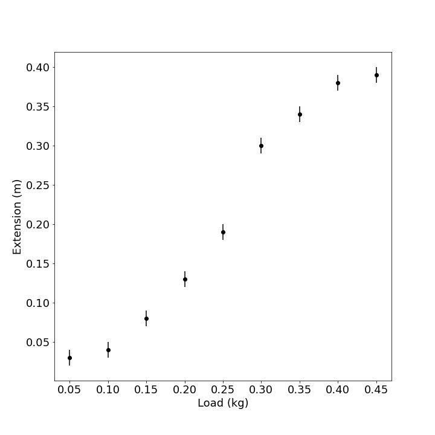
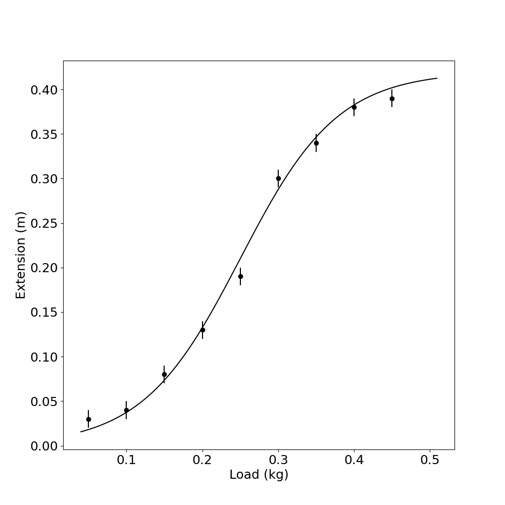
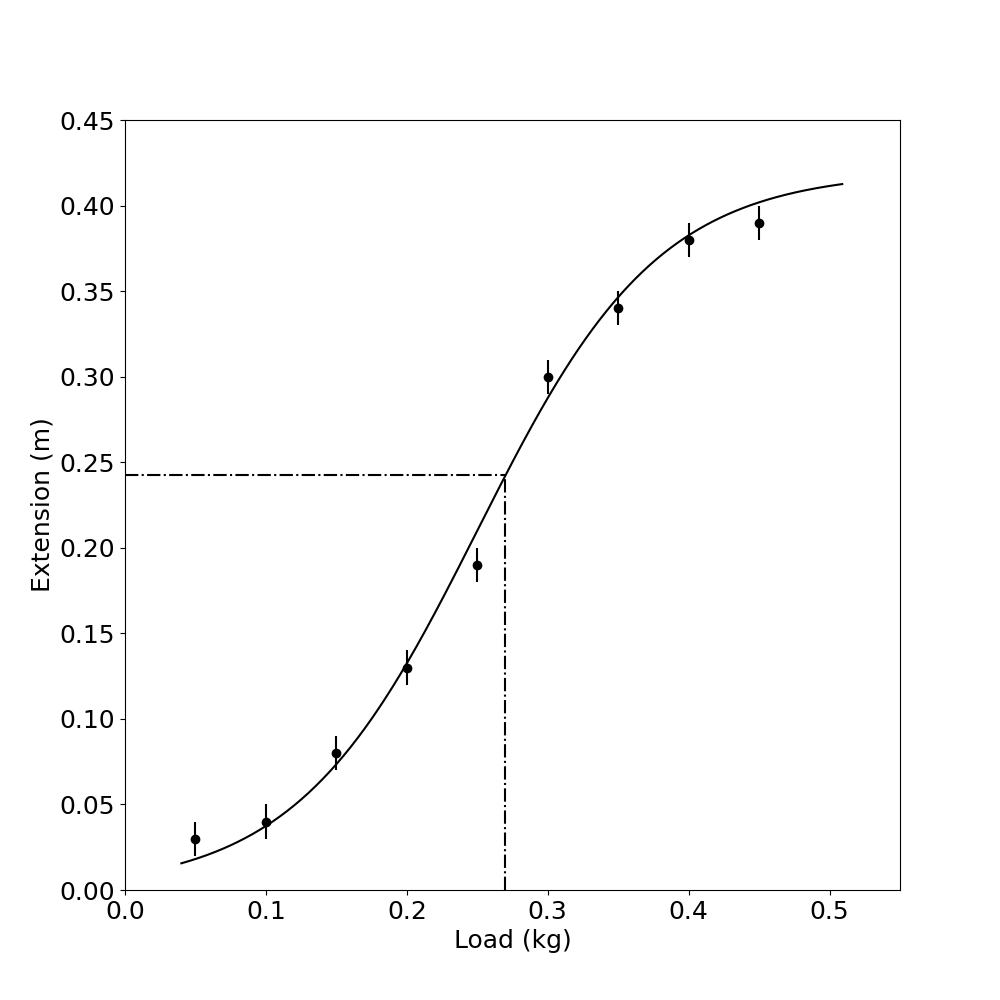
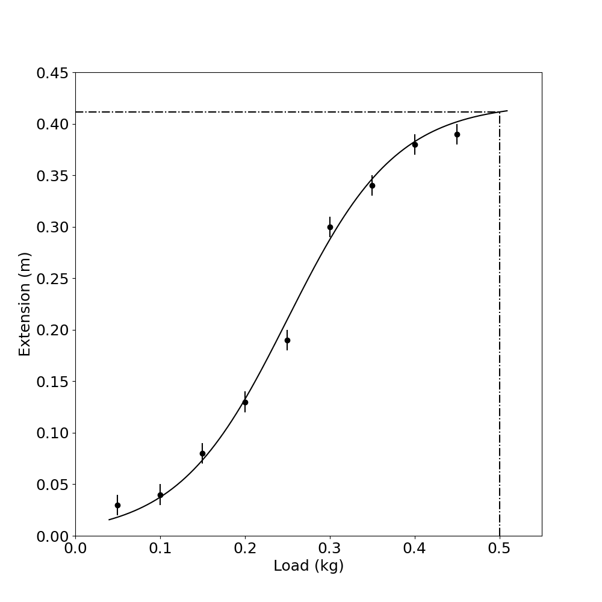
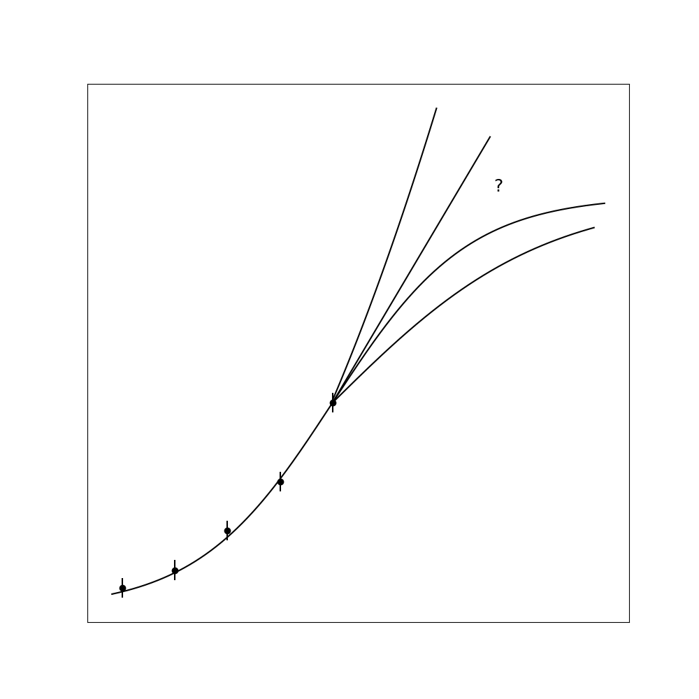
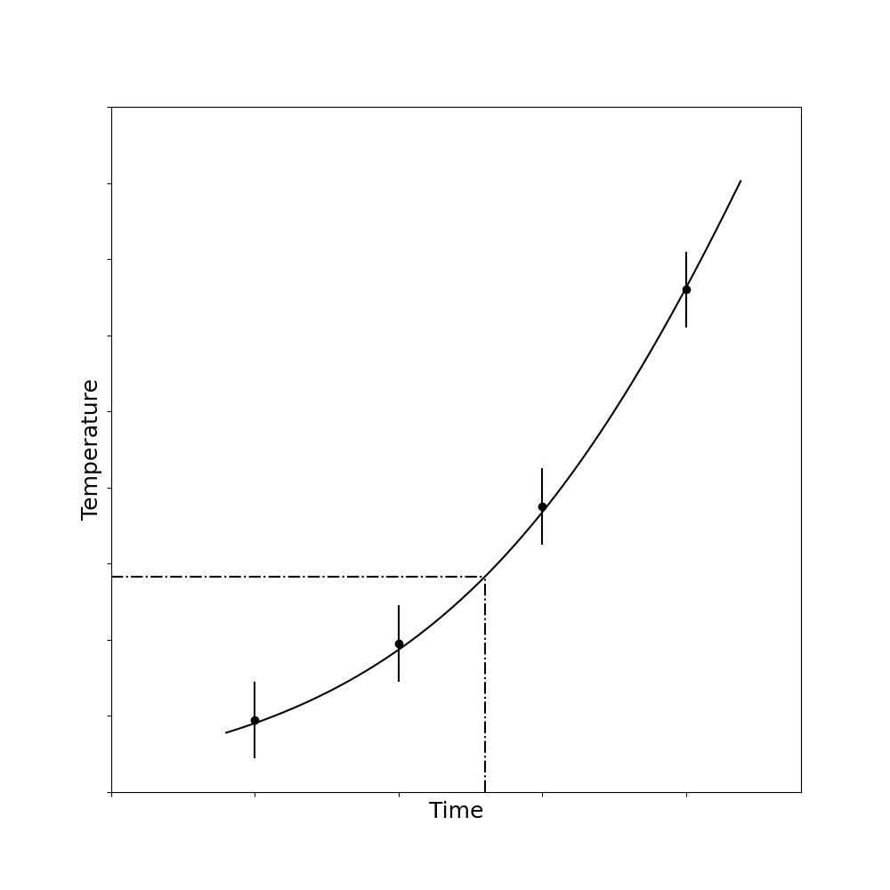
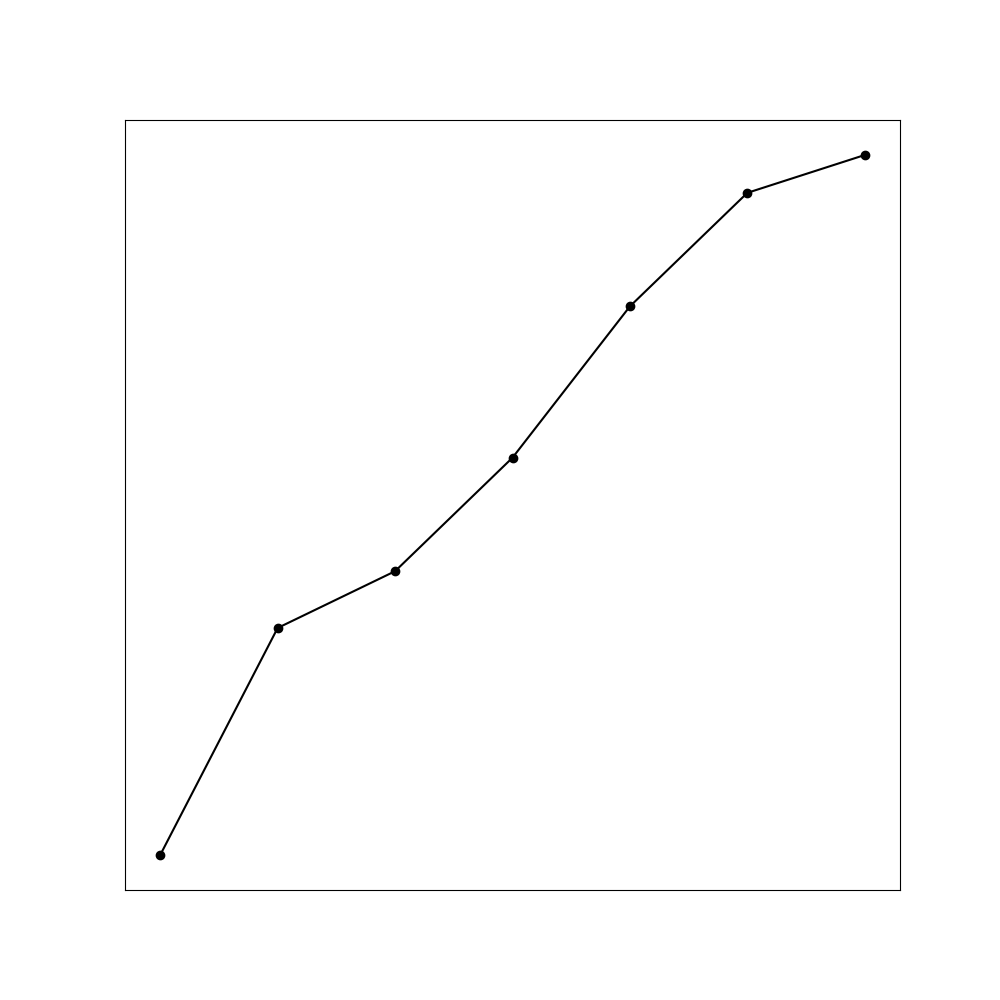
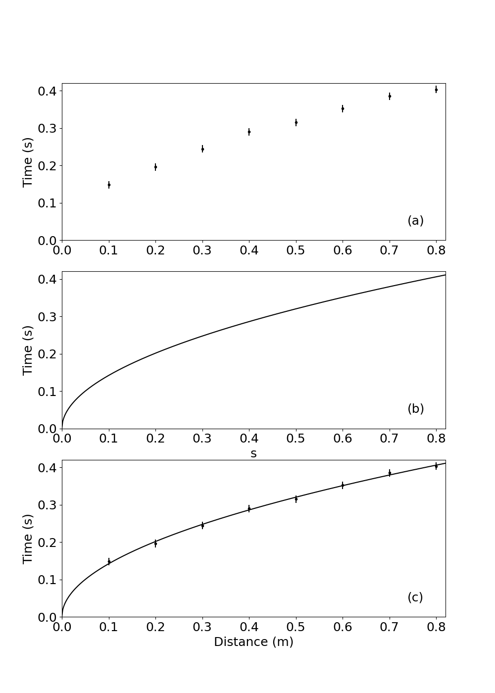
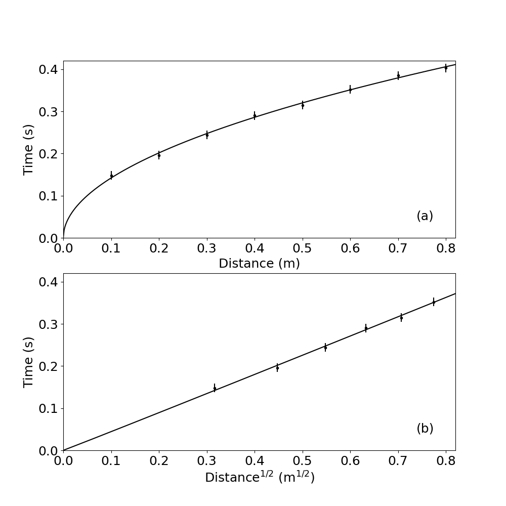
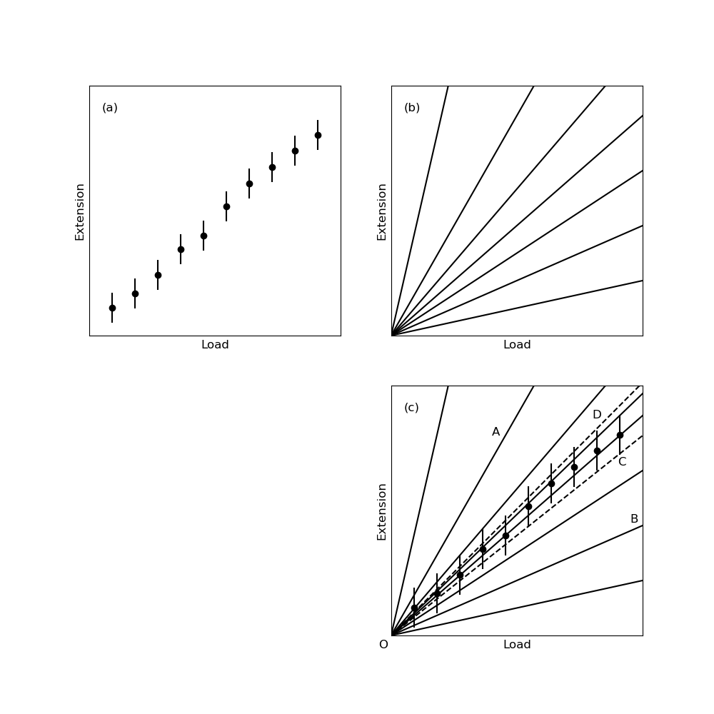

# The Nature of Scientific Thinking

## The Interplay Between Observation and Understanding

Scientific activity follows certain patterns that emerge naturally from the challenges we face when trying to understand the world around us. To grasp how scientific thinking works, let's imagine we're developing a completely new field of study from first principles.

When confronted with an unfamiliar phenomenon, our initial impulse is to ask: "What causes this?" This fundamental question has driven investigations into everything from light diffraction to radioactivity, from superconductivity to pulsars. Today, we continue asking this same question about elementary particles, climate change, cancer, and countless other phenomena.

While asking about causes seems natural, we should recognize that these questions are fundamentally about relationships between observable variables. Rather than pursuing abstract notions of causation that might lead us into philosophical quagmires, scientists look for consistent patterns of relationship. 

For instance, when investigating electrical conductivity, we might observe that current flow depends strongly on the potential difference across a conductor but shows no relationship to whether the conductor points north-south or east-west. This observation, though seemingly elementary to modern eyes, represents exactly the kind of relationship-finding that drives scientific progress.

During initial investigations of new phenomena, we focus on identifying which variables matter and which don't. By determining these significant relationships, we narrow our focus to manageable dimensions and create the foundation for both experimental work and theoretical understanding.

Interestingly, this initial stage of science allows us to make relatively definitive statements, since we're describing direct observations. This partly explains why scientific activities gain a reputation for revealing "scientific truth." However, this certainty applies primarily to the basic identification of relationships. As we move beyond this foundational stage, we enter realms that involve much greater uncertainty and interpretation.

## Models: The Conceptual Heart of Science

After identifying significant variables, we progress to a more sophisticated level of understanding by developing models. To appreciate what models are and how they function, consider a simple example:

Imagine needing to calculate how much paint to buy for a wall. Naturally, you'd measure the wall's length and height, then multiply these values to determine the area. But pause to consider what this calculation actually represents. When we multiply length by height, we're calculating the area of a perfect rectangle – an abstract geometric concept that exists only in our minds. This imaginary rectangle might correspond closely to the real wall, or it might differ substantially.

The critical insight here is that we're dealing with two entirely different categories: 
1. The actual physical wall that needs painting
2. A conceptual rectangle constructed from mathematical definitions

We often overlook this distinction because the concept of rectangles is so familiar that we instinctively assess whether a wall is "rectangular enough" for our calculation to be useful. But imagine if we couldn't make this assessment – if, like a blind person, we could only measure the base and one side without verifying angles or other properties. In such cases, we might calculate an area with little relevance to the actual wall (if, for instance, the wall was shaped like a parallelogram).

To avoid such errors, we would need to systematically check whether our conceptual rectangle matches the actual wall by comparing multiple properties: straightness of sides, right-angle corners, equality of diagonals, and so on. Only after confirming sufficient correspondence between our mental model and physical reality could we confidently use the calculated area for practical purposes.

This distinction between reality and mental constructs lies at the heart of scientific thinking. In all scientific endeavors, we find ourselves navigating between two realms:
- The physical world and our observations of it
- Conceptual constructs built from definitions and assumptions

These constructs are called **models**, and they pervade both scientific and everyday thinking. The painter envisioning a rectangular wall, the botanist categorizing a flower within a species, and the economist analyzing a national economy using equations – all are using models to represent reality.

Models serve as shorthand descriptions of systems, providing frameworks for thought, communication, calculation, and further investigation. However, we must remember their fundamental nature: models are invented concepts, not reality itself. While we construct them to correspond as closely as possible to the physical world, no model can ever be an exact replica of reality. A wall isn't actually a rectangle; a wheel isn't actually a circle. At best, a model's properties may be similar to reality's properties, and a model's usefulness depends on how well these properties align.

## Testing Models Against Reality

When beginning an experiment, we rarely know how well our model will correspond to the system we're studying. Therefore, a crucial first step is testing the model against reality. Only if experimental evidence shows adequate correspondence between model and system are we justified in proceeding further – just as our hypothetical painter needs to verify the wall's rectangularity before calculating paint requirements.

For a model to be scientifically useful, it must be testable against observation. This requirement distinguishes scientific models from other forms of thought. A proposition about "how many angels can dance on a pinhead" falls outside science not because it's necessarily meaningless, but because it can't be tested against experience. Such ideas may still have value as mathematical, philosophical, aesthetic, or ethical propositions – they simply aren't scientific.

## Refining Models Through Iteration

In practice, any model we develop will inevitably be incomplete and imperfect. Consider our wall-painting example again. If we were to test a rectangular model against an actual wall with increasing precision, we'd eventually discover discrepancies. Perhaps the corners aren't perfectly square, or the surfaces aren't perfectly flat. 

When these discrepancies become significant at our required level of precision, we must modify our model. We might adjust angles or dimensions, hoping that these refinements will improve the match between model and reality. Even with such adjustments, the model remains a conceptual construct, and the calculated area belongs to the model, not to the physical wall itself.

This principle applies throughout science. We should feel free to modify our models whenever necessary, since they're simply tools we've created to help understand reality. Our only consideration should be improving the model's utility. Because it's likely impossible to create a description that perfectly captures every aspect of physical reality, the continuous refinement and eventual replacement of models is a natural part of scientific progress.

This ongoing refinement process defines much of what scientists do, whether in "pure" research, technological development, or social sciences. While challenging work, this process builds on generations of previous efforts. In our professional lives, we're fortunate if we can make even small improvements to existing models. Major revisions or entirely new models are rare achievements, often worthy of Nobel Prizes.

Yet we needn't be fixated on perpetual model improvement. Though no model perfectly captures reality, many models correspond sufficiently well for practical purposes. In such cases, we can proceed confidently with our work, remembering to periodically verify the model's continued adequacy. Rather than thinking in terms of "right" or "wrong" models, we should consider whether a model is "adequate," "suitable," or "appropriate" for our specific purposes.

## The Historical Development of Scientific Models

From our discussion, one might imagine scientific development following a fixed sequence: observation first, model-building second. While science has often progressed this way, the sequence isn't invariable. History shows numerous examples where theoretical ideas preceded observational confirmation.

Consider Louis de Broglie's 1924 proposal of matter's wave properties, published before direct observation of electron diffraction, or Enrico Fermi's conception of the neutrino, proposed nearly four decades before experimental detection. There is no singular "scientific method" – rather, ideas and observations advance together, sometimes with one leading, sometimes the other.

What remains constant, regardless of developmental sequence, is the fundamental scientific activity: comparing models with reality through experiment.

We haven't discussed how entirely new theoretical frameworks emerge. Sometimes existing ideas undergo gradual refinement, achieving better correspondence with observation without fundamentally changing (like the Ptolemaic system of planetary epicycles). Other times, progress requires radical reconceptualization (as with Einstein's general relativity or Schrödinger's wave mechanics).

One might expect outdated models to be immediately discarded after major scientific revolutions. Sometimes this happens – few modern scientists discuss phlogiston or the four elements (earth, fire, air, and water). However, superseded models often retain practical utility because of their simplicity or adequacy within specific domains.

When determining a well's depth by dropping a stone, Einstein's general relativity isn't necessary – Newtonian mechanics suffices. We reserve more sophisticated models for circumstances that demand them, like predicting Mercury's orbital peculiarities. Einstein's theory doesn't invalidate Newton's for everyday applications; it simply provides better correspondence with reality at higher precision or in extreme conditions.

Generally, we choose theories based on adequacy for our purposes. When higher precision becomes necessary, we introduce appropriate refinements (unless working at knowledge frontiers where improved theories don't yet exist).

## Making Precise Comparisons Between Models and Reality

To summarize our understanding so far, scientific thinking involves four key elements:
1. Observation of physical phenomena
2. Construction of conceptual models
3. Systematic comparison between model properties and real-world properties
4. Progressive model refinement based on these comparisons

Let's now examine how we practically compare models with physical systems. Vague conceptual comparisons won't suffice; we need explicit, quantitative methods. This typically requires quantitative observation of the system alongside mathematical specification of the model.

Consider a simple experiment: an elastic band suspended from above, with weights hanging from its lower end. At the most basic level, we might verbally describe our observations: "As more weight is added, the elastic band stretches further." This description might suggest a general concept of "springiness" as a model.

However, to make this vague notion useful for detailed comparison with reality, we need mathematical precision. We might measure the elastic band's extension as a function of load, collecting data like that shown in Table 4.1.

While we've now collected measurements, a table of numbers doesn't readily reveal patterns or relationships. Visual representation helps tremendously. By plotting these measurements on a graph (Figure 4.1), including both central values and uncertainty ranges, we can more easily judge the system's behavior.

At this stage, we've completed only the observation phase. Our next task is constructing a model to represent the system.

## Approaches to Model Construction

The specific modeling approach depends on our experimental circumstances. If we're investigating a completely novel phenomenon, we'll need to identify significant variables and potentially develop an original model. If working with a familiar phenomenon, we might apply existing theories to create a model.

We can distinguish between two broad categories of models:

1. **Empirical models**: Based solely on observations without reference to underlying mechanisms
2. **Theoretical models**: Constructed from fundamental principles about how the system operates

Let's examine each approach.

### Empirical Models

Suppose we've collected measurements (like our elastic band data) for a system without an established model. How might we construct one? Several approaches exist, with increasing sophistication:

**Verbal Description**: The simplest model might be a verbal characterization, such as "The extension increases smoothly with load in an S-shaped curve." While basic, even this represents a conceptual shift from discussing individual data points to proposing a continuous relationship. This construction might later prove inadequate if, for instance, the actual relationship involves discrete steps rather than smooth changes.

**Smooth Curve Fitting**: A more sophisticated approach involves drawing a smooth curve through observed points (Figure 4.2). This assumes the system's behavior is continuous and regular despite measurement uncertainty and scatter.

This assumption often holds for physical systems (like planetary motion), but responsibility for making this judgment rests with the experimenter based on knowledge of the system.

The smooth curve approach offers practical benefits, particularly for interpolation and extrapolation. If we need to estimate extension at a load between measured values, the curve provides a systematic method (Figure 4.3).

Similarly, we might attempt to estimate values beyond our measurement range (Figure 4.4), though extrapolation is inherently less reliable than interpolation. We should have strong reasons to believe the system's behavior remains consistent beyond measured ranges, as smooth behavior within measured regions doesn't guarantee similar behavior beyond them (Figure 4.5).

Mathematical interpolation/extrapolation methods can perform these estimates without physically drawing curves, but they still depend fundamentally on assumptions about the system's regularity.

Without careful consideration, interpolation and extrapolation can lead to serious errors. Consider Figure 4.6, showing temperature measurements against time. If asked to interpolate between points without knowing the context, someone might draw a smooth curve. Revealing that these are noontime temperatures for successive days would demonstrate the error – interpolating would estimate midnight temperatures!

A common but problematic practice is connecting measured points with straight-line segments (Figure 4.7). Computer graphics often do this automatically. But such representations satisfy neither the requirements of observation (they're not data points) nor modeling (they don't represent our conceptual understanding of the system).

**Mathematical Function Fitting**: At higher sophistication levels, we can employ mathematical methods to find analytical functions that approximate our observations. Though mathematically complex, these methods still fundamentally depend on assumptions about the system's regularity.

Empirically derived functions can serve as useful mathematical models, enabling interpolation and extrapolation with varying degrees of precision. However, we must remember that these functions' validity as models depends on how well they capture the system's actual behavior.

Extrapolation particularly highlights model limitations. We can accurately predict sunset times weeks ahead because astronomical models are excellent, but weather forecasting becomes increasingly uncertain with time, and stock market prediction remains nearly impossible. The model's quality determines prediction reliability.

### Theoretical Models

Theoretical models represent the familiar realm of theoretical physics. Unlike empirical models derived directly from observations, theoretical models are constructed from foundational elements (definitions, axioms, hypotheses, principles) followed by logical derivation.

Since theories are human constructs, their applicability to physical systems must be verified through experiment. Let's illustrate this with an example:

Consider measuring the fall time of a steel ball dropped from various heights. For an empirical approach, we would simply measure fall times at different heights and plot the results (Figure 4.8), perhaps fitting a curve.

For a theoretical approach, we'd begin with fundamental principles. We might hypothesize constant gravitational acceleration:

$$a = 9.8 \text{ m/s}^2$$

This hypothesis immediately incorporates assumptions (like neglecting air resistance) that begin our model construction process. These assumptions might or might not make it a "good" model – that determination awaits experimental verification.

Through mathematical derivation (integration), we obtain:

$$v = 9.8t \text{ (assuming } v=0 \text{ at } t=0\text{)}$$

And:

$$x = \frac{9.8}{2}t^2 \text{ (assuming } x=0 \text{ at } t=0\text{)}$$

Rearranging to express time as a function of distance:

$$t = \left(\frac{1}{4.9}\right)^{1/2}x^{1/2}$$

Throughout this derivation, each assumption becomes part of our model. The final equation represents a property of our model, not necessarily of reality. We must next determine how well this theoretical prediction matches actual measurements.

## Comparing Theoretical Models with Experimental Results

Let's examine actual measurements from our free-fall experiment, shown in Table 4.2. We've treated fall distance as our independent variable (input) and fall time as our dependent variable (output).

How should we compare these measurements with our theoretical prediction? We could calculate theoretical times for each distance and compare numerically, but this approach has limitations. Small uncertainties in measurements make exact agreement unlikely, and more importantly, our model likely contains systematic approximations.

A more effective approach uses visual comparison. Figure 4.9 shows: (a) a graph of our experimental measurements as points, (b) our theoretical model as a continuous curve, and (c) both superimposed for direct comparison.

This visual comparison allows us to judge overall correspondence between model and reality. We can immediately see whether they agree, where discrepancies exist, and their magnitude relative to measurement uncertainty.

This approach clarifies what we can legitimately claim after an experiment. We can state that model and system behavior correspond (or don't) to a certain extent – not that a theory is "true," "correct," or "wrong." Such terminology misrepresents the nature of models. Better to describe models as "satisfactory," "good enough," or "appropriate" for particular purposes.

Our simple constant-acceleration model works perfectly for determining well depths but would be inadequate for calculating lunar spacecraft trajectories. For the latter, we'd need refinements. Similarly, Newtonian gravitational theory adequately predicts most planetary motion but fails for Mercury's orbit, requiring Einstein's general relativity.

Yet Einstein's theory doesn't invalidate Newton's for everyday applications – it simply provides a more comprehensive model with greater correspondence at extreme scales or precisions. Most people don't measure well depths using relativity theory! We choose models based on adequacy for our specific purpose, introducing refinements only when necessary.

This perspective offers an interesting philosophical insight: even when model and system appear to correspond perfectly, we can only claim that, at our current precision level, we haven't detected discrepancies. We can be more definitive when finding disagreement – we can confidently state a model is inadequate if discrepancies significantly exceed measurement uncertainty.

Modern computing has transformed model comparison. While drawing graphs for complex functions once presented major difficulties, computers now display experimental measurements alongside theoretical predictions instantly. Nevertheless, understanding fundamental comparison principles remains essential, both for situations without computers and for ensuring meaningful interpretation of computer-generated results.

## Linear Analysis: A Powerful Technique

When limited to manual graphing tools, comparing models with data becomes most practical using straight-line relationships. This approach remains powerful and widely used even in the computer era.

Consider our free-fall time equation:

$$t = \left(\frac{1}{4.9}\right)^{1/2}x^{1/2}$$

Plotting this directly against measurements would create a parabolic curve, making visual assessment difficult. However, if we plot $t$ versus $x^{1/2}$ instead, our theoretical relationship becomes linear:

$$t = 0.4515 \times x^{1/2}$$

Which follows the form:
$$\text{vertical variable} = \text{slope} \times \text{horizontal variable}$$

Where:
- vertical variable = $t$
- horizontal variable = $x^{1/2}$
- slope = 0.4515

Table 4.3 shows these transformed values, and Figure 4.10 displays both the measurements and theoretical line in this format. The transformation dramatically simplifies comparison, making correspondence or discrepancy immediately apparent.

Alternative transformations could work equally well – plotting $t^2$ versus $x$ instead of $t$ versus $x^{1/2}$ would also yield a straight line with different slope. The choice depends on convenience and which approach provides clearer comparison for a particular experiment.

## Determining Unknown Constants

Often our theoretical models contain unknown constants that must be determined experimentally. For example, when testing Hooke's law (that spring extension is proportional to load), we might not know the spring constant:

$$x = \text{constant} \times W$$

After measuring extension versus load and plotting the results (Figure 4.11a), how do we represent this model? The equation actually represents an infinite family of straight lines passing through the origin, with slopes representing all possible spring constant values.

Overlaying this family of lines on our measurements (Figure 4.11c) allows us to identify which lines reasonably match our data. While some lines (like OA and OB) clearly don't correspond to observations, we can identify a range of lines (bounded by OC and OD) that fall within measurement uncertainty.

This process tells us that observations are compatible with our model for a certain range of spring constant values. This approach – using graphical analysis to determine model parameters – represents the standard method for measuring physical quantities experimentally.

This graphical approach offers significant advantages beyond simply testing model validity. Consider measuring electrical resistance from voltage-current measurements. We could calculate $R = V/I$ for each measurement pair and average the results, but this algebraic approach can introduce serious errors:

1. It doesn't allow us to visually assess model validity (whether V-I relationship is actually linear)
2. It cannot handle data scatter effectively
3. It cannot detect or compensate for systematic issues like unexpected intercepts or non-linearity at certain ranges

With a graphical approach, even with scattered data, we can confidently determine resistance from the slope of a line that best represents the overall trend. If measurements show an unexpected intercept or deviate from linearity in certain regions, we can still extract reliable resistance values from the linear portion, unaffected by these discrepancies.

Purely algebraic calculations would incorporate values from all measurements regardless of their relationship to the underlying model, potentially introducing significant errors. The graphical method makes discrepancies immediately visible and allows informed judgment about their significance.

Importantly, this approach lets us obtain accurate parameter values even without knowing the source of discrepancies between model and system. We need only identify discrepancies and ensure they don't contaminate our results; investigating their causes can come later.

While we've focused on determining constants from slopes, straight-line graphs actually provide two independent pieces of information – slope and intercept. This allows experiments to determine two separate quantities within a model, a capability we'll explore further in later chapters.
